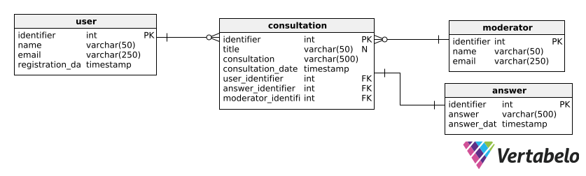
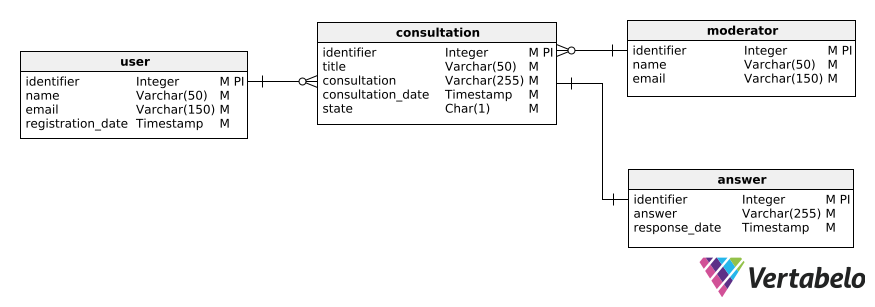

# GESTIÓN DE CONSULTAS EN LÍNEA

## Descripción del caso

En el contexto de una plataforma que busca ofrecer soporte eficiente a sus usuarios, se identificó la necesidad de un sistema que gestione consultas realizadas a través de diversos canales digitales. Estas consultas pueden estar relacionadas con productos, servicios, o dudas generales, y su adecuada atención impacta directamente en la satisfacción del usuario y la eficiencia operativa.

El sistema de **Gestión de Consultas en Línea** busca centralizar el manejo de consultas, asignarlas automáticamente a los moderadores, y garantizar respuestas rápidas y personalizadas.

### Alcance

- **Registro de consultas:** Permitir que los usuarios registren nuevas consultas con detalles específicos.
- **Asignación de moderadores:** Facilitar la asignación de consultas a los moderadores disponibles.
- **Gestión de respuestas:** Vincular respuestas específicas a cada consulta.
- **Rastreo y análisis:** Mantener un registro detallado del historial de consultas y respuestas, con datos asociados como fecha, usuario, y moderador asignado.

### Beneficios esperados

- **Eficiencia operativa:** Reducción en el tiempo de respuesta.
- **Mejora en la experiencia del usuario:** Respuestas claras y rápidas a través del canal preferido.
- **Análisis estratégico:** Generación de informes sobre las consultas atendidas, el tiempo de respuesta, y la eficiencia del equipo.

#### Diseño Fisico - Consultas

#### Diseño Lógico - Consultas

### Diccionario de Datos

Puedes consultar el diccionario de datos completo en el siguiente enlace: 

[Diccionario de Datos - Consultas](../resources/df_consultas.pdf)
